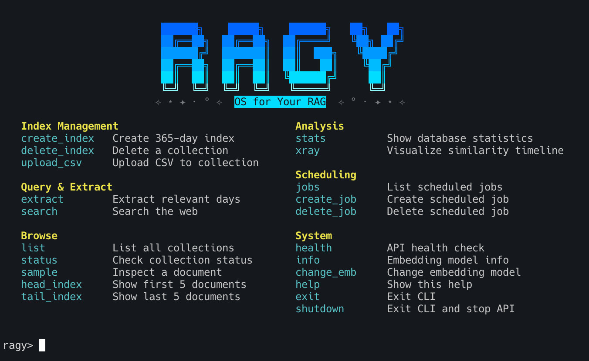
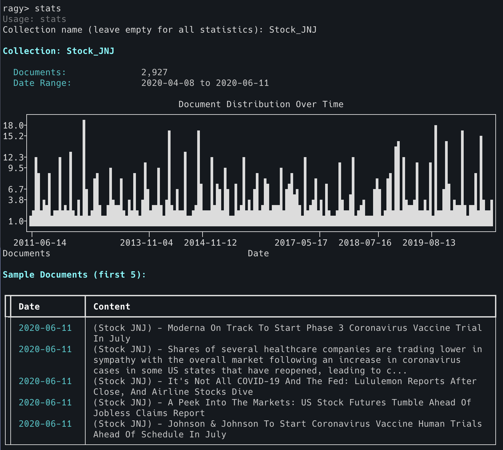
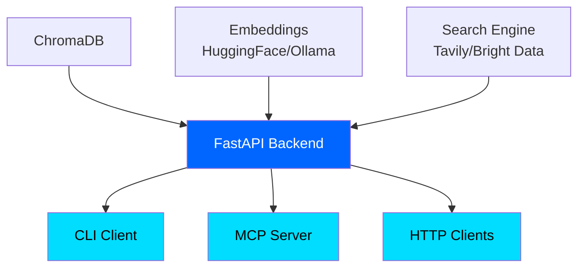

<div align="center">

<!-- PLACEHOLDER: Add your banner image here -->


# RagyApp

**OS for Your RAG**

<!-- PLACEHOLDER: Add your badges here -->
[](https://www.python.org/)
[](LICENSE)
[](https://github.com/Arseni1919/ragy)

*A FastAPI-based RAG application that builds 365-day vector indices from daily search queries and enables semantic retrieval of temporal data.*

</div>

---

## 📋 Table of Contents

- [Quick Start](#-quick-start)
- [Installation](#-installation)
- [CLI Commands](#-cli-commands)
- [API Endpoints](#-api-endpoints)
- [Usage Examples](#-usage-examples)
- [MCP Integration](#-mcp-integration)
- [Project Structure](#-project-structure)
- [Architecture](#-architecture)
- [Contributing](#-contributing)

---

## 🚀 Quick Start

<!-- PLACEHOLDER: Add screenshot of CLI with logo and menu -->


### One-Command Installation

```bash
curl -fsSL https://raw.githubusercontent.com/Arseni1919/ragy/main/install.sh | bash
```

### Quick Setup

1. **Configure API keys** in `.env`
2. **Start the API**: `uv run uvicorn ragy_api.main:app --reload`
3. **Launch CLI**: `uv run ragy`

---

## 📦 Installation

### Prerequisites

- Python 3.12+
- [uv](https://github.com/astral-sh/uv) package manager

### Step-by-Step Installation

**1. Clone the repository**

```bash
git clone https://github.com/Arseni1919/ragy.git
cd ragy
```

**2. Install dependencies**

```bash
uv sync
```

**3. Configure environment**

Create a `.env` file:

```bash
# Required API Keys
TAVILY_API_KEY="your-tavily-api-key"
GEMINI_API_KEY="your-gemini-api-key"

# Optional Configuration (defaults shown)
HF_EMB_MODEL="all-MiniLM-L6-v2"
DB_PATH="./ragy_db"
RAGY_MAX_CONCURRENT=10
API_HOST="0.0.0.0"
API_PORT=8000
SCHEDULER_ENABLED=true
SCHEDULER_HOUR=2
SCHEDULER_TIMEZONE="UTC"
```

**4. Start the API server**

Development mode (with auto-reload):
```bash
uv run uvicorn ragy_api.main:app --reload --host 0.0.0.0 --port 8000
```

Production mode (with multiple workers):
```bash
uv run uvicorn ragy_api.main:app --workers 4 --host 0.0.0.0 --port 8000
```

**5. Launch the CLI**

```bash
uv run ragy
```

The CLI automatically checks if the API is running and offers to start it if needed.

**6. Access API documentation**

- **Swagger UI**: http://localhost:8000/docs
- **ReDoc**: http://localhost:8000/redoc
- **Health Check**: http://localhost:8000/api/v1/system/health

---

## 💻 CLI Commands

Complete reference of all 21 interactive commands:

### Index Management

| Command | Description | Usage |
|---------|-------------|-------|
| `create_index` | Create 365-day vector index | Creates temporal index for specified query |
| `delete_index` | Delete a collection | Removes collection with confirmation |
| `upload_csv` | Upload CSV to collection | Bulk import from CSV file (drag & drop supported) |

### Query & Extract

| Command | Description | Usage |
|---------|-------------|-------|
| `extract` | Extract relevant days | Vector similarity search with top-K results |
| `search` | Search the web | Web search using Tavily API |

### Browse

| Command | Description | Usage |
|---------|-------------|-------|
| `list` | List all collections | Shows all available collections |
| `status` | Check collection status | Display collection document count |
| `sample` | Inspect a document | View specific document by index |
| `head_index` | Show first 5 documents | Preview collection start |
| `tail_index` | Show last 5 documents | Preview collection end |

### Analysis

| Command | Description | Usage |
|---------|-------------|-------|
| `stats` | Show database statistics | Comprehensive database overview |
| `xray` | Visualize similarity timeline | Plot similarity scores over time |

### Scheduling

| Command | Description | Usage |
|---------|-------------|-------|
| `jobs` | List scheduled jobs | Show all recurring jobs |
| `create_job` | Create scheduled job | Set up automatic updates |
| `delete_job` | Delete scheduled job | Remove recurring job |

### System

| Command | Description | Usage |
|---------|-------------|-------|
| `health` | API health check | Verify system status |
| `info` | Embedding model info | Show model details |
| `change_emb` | Change embedding model | Update model in .env |
| `help` | Show help | Display command list |
| `exit` | Exit CLI | Close application (alias: `quit`) |
| `shutdown` | Exit and stop API | Close CLI and stop background API |

---

## 🔌 API Endpoints

Complete reference of all 19 REST API endpoints:

### Search

| Method | Endpoint | Description |
|--------|----------|-------------|
| `POST` | `/api/v1/search/web` | Execute web search with query |

### Extract

| Method | Endpoint | Description |
|--------|----------|-------------|
| `GET` | `/api/v1/extract/collections` | List all available collections |
| `POST` | `/api/v1/extract/data` | Extract relevant data (SSE streaming) |
| `POST` | `/api/v1/extract/all` | Get all documents with similarity scores |

### Index

| Method | Endpoint | Description |
|--------|----------|-------------|
| `POST` | `/api/v1/index/create` | Create 365-day index (SSE streaming) |
| `GET` | `/api/v1/index/status/{name}` | Get index creation status |

### Database

| Method | Endpoint | Description |
|--------|----------|-------------|
| `GET` | `/api/v1/database/content` | List all collections in database |
| `GET` | `/api/v1/database/stats` | Get comprehensive database statistics |
| `GET` | `/api/v1/database/collection/{name}/distribution` | Get date distribution for collection |
| `GET` | `/api/v1/database/collection/{name}/sample/{index}` | Get specific document by index |
| `GET` | `/api/v1/database/collection/{name}/head` | Get first N documents |
| `GET` | `/api/v1/database/collection/{name}/tail` | Get last N documents |
| `GET` | `/api/v1/database/collection/{name}` | Get collection details |
| `DELETE` | `/api/v1/database/collection/{name}` | Delete collection |

### System

| Method | Endpoint | Description |
|--------|----------|-------------|
| `GET` | `/api/v1/system/health` | Health check (database, embedding, scheduler) |
| `GET` | `/api/v1/system/embedding/info` | Get embedding model information |
| `POST` | `/api/v1/system/embedding/encode` | Encode text to embedding vector |
| `GET` | `/api/v1/system/scheduler/jobs` | List all scheduled jobs |
| `POST` | `/api/v1/system/scheduler/trigger` | Manually trigger scheduler update |
| `POST` | `/api/v1/system/scheduler/jobs/create` | Create new scheduled job |
| `GET` | `/api/v1/system/scheduler/jobs/user` | Get user-created jobs |
| `DELETE` | `/api/v1/system/scheduler/jobs/delete/{job_id}` | Delete scheduled job |

### Upload

| Method | Endpoint | Description |
|--------|----------|-------------|
| `POST` | `/api/v1/upload/csv` | Upload and import CSV file |

---

## 📚 Usage Examples

### Example 1: Create Your First Index

**CLI:**
```bash
ragy> create_index
Query: artificial intelligence news
Collection name: ai_2024
Number of days (365): 365
```

**API:**
```bash
curl -N -X POST http://localhost:8000/api/v1/index/create \
  -H "Content-Type: application/json" \
  -d '{
    "query": "artificial intelligence news",
    "collection_name": "ai_2024",
    "num_days": 365,
    "save_full_data": true
  }'
```

<!-- PLACEHOLDER: Add screenshot of index creation -->


---

### Example 2: Search and Extract Data

**Search the web:**
```bash
ragy> search
Query: latest machine learning breakthroughs
```

**Extract from collection:**
```bash
ragy> extract
Collection: ai_2024
Query: transformer models
Top K: 5
```

**API equivalent:**
```bash
curl -X POST http://localhost:8000/api/v1/extract/all \
  -H "Content-Type: application/json" \
  -d '{
    "query": "transformer models",
    "collection_name": "ai_2024",
    "top_k": 5
  }'
```

---

### Example 3: Upload CSV Data

**CLI (with drag & drop):**
```bash
ragy> upload_csv
CSV file path (drag file here): /path/to/data.csv
Collection name: stock_data
✓ Uploaded 1000 documents to 'stock_data'
```

**CSV format:**
```csv
date,content,title,url
2024-01-15,Article about AI developments,AI News,https://example.com
2024-01-16,Stock market analysis,Market Update,https://example.com
```

Required columns: `date`, `content`
Optional columns: Any additional columns stored as metadata

---

### Example 4: Visualize with Xray

<!-- PLACEHOLDER: Add screenshot of xray visualization -->


**CLI:**
```bash
ragy> xray
Collection: ai_2024
Query: GPT-4
Top K: 10
```

Displays:
- Timeline plot of similarity scores
- Top K results table with dates and content

---

### Example 5: Schedule Automatic Updates

**CLI:**
```bash
ragy> create_job
Query: tech news
Collection name: daily_tech
Interval type (daily/hourly/weekly): daily
Interval amount: 1
```

**API:**
```bash
curl -X POST http://localhost:8000/api/v1/system/scheduler/jobs/create \
  -H "Content-Type: application/json" \
  -d '{
    "query": "tech news",
    "collection_name": "daily_tech",
    "interval_type": "daily",
    "interval_amount": 1
  }'
```

---

### Example 6: View Database Statistics

<!-- PLACEHOLDER: Add screenshot of stats command -->


**CLI:**
```bash
ragy> stats
```

Shows:
- Total documents across all collections
- Collection names and document counts
- Date ranges for each collection

---

## 🤖 MCP Integration

RagyApp exposes its API through the Model Context Protocol (MCP), allowing AI agents like Claude to interact with your RAG system.

### Available MCP Tools

- `list_collections` - List all database collections
- `search_web` - Search the web using Tavily API
- `extract_all` - Extract relevant documents by similarity
- `get_database_stats` - Get database statistics
- `health_check` - Check API server health

### Setup for Claude Desktop

**1. Start the API server** (required for MCP):
```bash
uv run uvicorn ragy_api.main:app --host 0.0.0.0 --port 8000
```

**2. Configure Claude Desktop**

Edit your `claude_desktop_config.json`:

**macOS:** `~/Library/Application Support/Claude/claude_desktop_config.json`
**Windows:** `%APPDATA%\Claude\claude_desktop_config.json`

```json
{
  "mcpServers": {
    "ragy": {
      "command": "uv",
      "args": ["run", "ragy-mcp"],
      "cwd": "/absolute/path/to/ragy"
    }
  }
}
```

**3. Restart Claude Desktop**

**4. Use the tools**

Ask Claude:
- "List all my RAG collections"
- "Search the web for recent AI news"
- "Show me database statistics"
- "Extract documents about machine learning from the ai_2024 collection"

<!-- PLACEHOLDER: Add screenshot of Claude using MCP tools -->


### Testing MCP Server

```bash
uv run ragy-mcp
```

The server communicates via stdio and requires the FastAPI backend on `localhost:8000`.

---

## 📁 Project Structure

```
RagyApp/
├── ragy_api/              # FastAPI backend
│   ├── main.py            # Application entry point
│   ├── config.py          # Environment configuration
│   ├── models.py          # Pydantic models
│   ├── scheduler.py       # APScheduler for daily updates
│   ├── services/          # Business logic
│   │   ├── search_service.py
│   │   ├── index_service.py
│   │   ├── extract_service.py
│   │   └── database_service.py
│   └── routers/           # API endpoints
│       ├── search.py
│       ├── extract.py
│       ├── index.py
│       ├── database.py
│       ├── system.py
│       └── upload.py
│
├── ragy_cli/              # CLI client
│   ├── cli.py             # Main entry point
│   ├── constants.py       # ASCII logo and branding
│   ├── commands.py        # Command definitions
│   ├── api_client.py      # HTTP client wrapper
│   └── handlers.py        # Command handlers
│
├── ragy_mcp/              # MCP server
│   ├── __init__.py
│   └── server.py          # MCP tools (5 core tools)
│
├── conn_db/               # ChromaDB connection
│   └── client.py
│
├── conn_emb_hugging_face/ # Hugging Face embeddings
│   └── client.py
│
├── conn_emb_ollama/       # Ollama embeddings (alternative)
│   └── client.py
│
├── conn_tavily/           # Tavily search API
│   └── client.py
│
├── conn_bright_data/      # Bright Data API (future)
│   └── client.py
│
├── sample_data/           # Sample datasets
│   └── load_data.py
│
├── pyproject.toml         # Dependencies and entry points
├── .env                   # Environment configuration
└── README.md              # This file
```

---

## 🏗 Architecture



### Component Overview

| Component | Description | Technology |
|-----------|-------------|------------|
| **ChromaDB** | Vector database for document storage and similarity search | ChromaDB |
| **Embeddings** | Text encoding to vector representations | Sentence Transformers (HuggingFace) |
| **Search Engine** | Web search for data collection | Tavily API |
| **FastAPI Backend** | Central API with 19 REST endpoints | FastAPI, Python 3.12+ |
| **CLI Client** | Interactive terminal interface (21 commands) | Rich, Prompt Toolkit |
| **MCP Server** | Model Context Protocol for AI agents | MCP Python SDK |
| **HTTP Clients** | Direct API access via curl/requests | Standard HTTP |

### Data Flow

1. **Index Creation**: Search Engine → FastAPI → Embeddings → ChromaDB
2. **Query**: CLI/MCP → FastAPI → Embeddings → ChromaDB → Results
3. **Scheduling**: APScheduler → FastAPI → Search Engine → ChromaDB

---

## 🤝 Contributing

We welcome contributions! Here's how you can help:

### Development Setup

1. Fork the repository
2. Clone your fork: `git clone https://github.com/Arseni1919/ragy.git`
3. Install dependencies: `uv sync`
4. Create a branch: `git checkout -b feature/your-feature`
5. Make changes and test
6. Commit: `git commit -m "Add your feature"`
7. Push: `git push origin feature/your-feature`
8. Open a Pull Request

### Development Guidelines

See [CLAUDE.md](CLAUDE.md) for:
- Code conventions
- Testing guidelines
- Development workflows
- Best practices

### Reporting Issues

Found a bug? Have a feature request?

- **GitHub Issues**: https://github.com/Arseni1919/ragy/issues
- Include: OS, Python version, error messages, steps to reproduce

---

## 📄 License

This project is licensed under the MIT License - see the [LICENSE](LICENSE) file for details.

---

## 🙏 Acknowledgments

- [ChromaDB](https://www.trychroma.com/) - Vector database
- [Tavily](https://tavily.com/) - Web search API
- [Sentence Transformers](https://www.sbert.net/) - Embedding models
- [FastAPI](https://fastapi.tiangolo.com/) - Web framework
- [Rich](https://rich.readthedocs.io/) - Terminal formatting

---

<div align="center">

**Made with ❤️ by the RagyApp Team**

[Documentation](https://github.com/Arseni1919/ragy) • [Issues](https://github.com/Arseni1919/ragy/issues) • [Discussions](https://github.com/Arseni1919/ragy/discussions)

</div>
