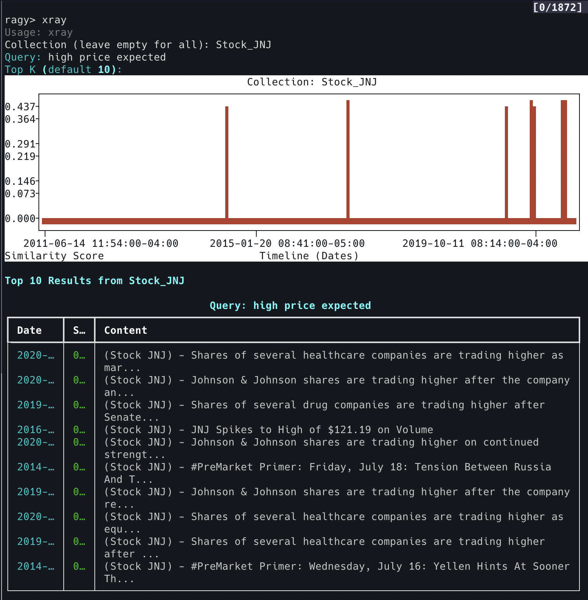
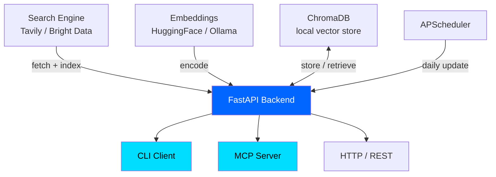

<div align="center">


[](https://www.python.org/)
[](LICENSE)
[](https://github.com/Arseni1919/ragy)

**Most RAG systems are stateless. Every query re-fetches, re-embeds, re-ranks.**

ragy is different: index any topic across a full time window *once*, then use semantic similarity to retrieve the right days — not all days. Temporal memory for your AI agents, financial research, and knowledge workflows.

</div>

---

## Why ragy?

Standard RAG retrieves documents. ragy retrieves *moments in time*.

You define a query (e.g. `"Fed interest rate signals"`) and a time window (e.g. 365 days). ragy fetches and embeds every day's content once, stores it in a local vector database, and lets you instantly answer: **"which days in the past year most resembled this?"** — ranked by cosine similarity, plotted on a timeline.

**Key difference from other RAG projects:**

| | Standard RAG | ragy |
|---|---|---|
| Data model | Documents | Days in time |
| Re-fetch per query? | Yes | No — indexed once |
| Time-aware? | No | Yes — date is a first-class dimension |
| Visualization | None | Similarity timeline (`xray`) |
| Scheduling | Manual | Built-in APScheduler |
| Agent integration | Varies | Native MCP server |

---

## What You Can Build

**📈 Financial research** — Index a year of market news, query `"Fed pivot signals"`, get back the 10 most semantically similar trading days with similarity scores on a timeline.

**🔍 Competitive intelligence** — Schedule daily indexing of topics. Ask "what weeks had the most activity around X?" Retrieve content ranked by relevance, not recency.

**🤖 AI agent long-term memory** — Give your Claude / LangGraph / n8n agent a persistent temporal knowledge base via MCP. No search API call on every turn — just semantic retrieval from your local index.

---

## See It in Action

### The `xray` command — your temporal similarity radar



```bash
ragy> xray
Collection: Stock_JNJ
Query: high price expected
Top K: 10
```

Returns a ranked list of dates with similarity scores, plotted on a timeline. This is the fastest way to understand *when* your topic was most relevant.

---

## Quick Start

### One-command install

```bash
curl -fsSL https://raw.githubusercontent.com/Arseni1919/ragy/main/install.sh | bash
```

### Manual setup

```bash
git clone https://github.com/Arseni1919/ragy.git
cd ragy
uv sync
```

Create a `.env` file — only one key is required:

```bash
TAVILY_API_KEY="your-key-here"   # Get free at tavily.com
```

Start the stack:

```bash
# Terminal 1 — API
uv run uvicorn ragy_api.main:app --reload

# Terminal 2 — CLI
uv run ragy
```

**First run note:** embedding models (~80MB) download automatically in the background. First query may take 10–30 seconds; subsequent runs are instant.

---

## Core Workflow

### 1. Index a topic over time

```bash
ragy> create_index
Query: artificial intelligence news
Collection name: ai_2024
Number of days: 365
```

This fetches, embeds, and stores one entry per day for the past 365 days. Run once. Query forever.

### 2. Retrieve semantically relevant days

```bash
ragy> extract
Collection: ai_2024
Query: transformer architecture improvements
Top K: 5
```

Returns the 5 days most semantically similar to your query — not keyword matches, not most recent, but most *relevant*.

### 3. Visualize similarity over time

```bash
ragy> xray
Collection: ai_2024
Query: open source model releases
Top K: 10
```

Plots similarity scores as a timeline. Instantly see if your topic had a spike, a gradual trend, or scattered activity.

### 4. Schedule automatic updates

```bash
ragy> create_job
Query: tech news
Collection name: daily_tech
Interval type: daily
```

ragy updates your collection every day at the scheduled hour. Your index stays current without manual work.

---

## CLI Reference

21 commands across 5 categories:

### Index Management
| Command | Description |
|---------|-------------|
| `create_index` | Build temporal vector index for a query + time window |
| `delete_index` | Remove a collection |
| `upload_csv` | Import from CSV (`date`, `content` columns required) |

### Query & Extract
| Command | Description |
|---------|-------------|
| `extract` | Retrieve top-K days by semantic similarity |
| `search` | Live web search via Tavily |

### Inspect
| Command | Description |
|---------|-------------|
| `list` | All collections |
| `status` | Document count for a collection |
| `sample` | Inspect a single document by index |
| `head_index` / `tail_index` | Preview first / last 5 documents |
| `stats` | Full database overview |
| `xray` | Similarity timeline plot |

### Scheduling
| Command | Description |
|---------|-------------|
| `jobs` | List scheduled jobs |
| `create_job` | Set up recurring index updates |
| `delete_job` | Remove a job |

### System
| Command | Description |
|---------|-------------|
| `health` | API health check |
| `info` | Embedding model details |
| `change_emb` | Swap embedding model |
| `help` / `exit` / `shutdown` | Utility commands |

---

## REST API

19 endpoints. Full Swagger UI at `http://localhost:8000/docs`.

| Category | Key Endpoints |
|----------|--------------|
| **Index** | `POST /api/v1/index/create` (SSE streaming) |
| **Extract** | `POST /api/v1/extract/data` · `POST /api/v1/extract/all` |
| **Database** | `GET /api/v1/database/stats` · `GET /api/v1/database/collection/{name}/distribution` |
| **Search** | `POST /api/v1/search/web` |
| **Scheduler** | `POST /api/v1/system/scheduler/jobs/create` |
| **Upload** | `POST /api/v1/upload/csv` |

---

## MCP Integration

ragy ships a native MCP server, letting Claude Desktop (and any MCP-compatible agent) query your temporal knowledge base directly.

### Available tools

| Tool | Description |
|------|-------------|
| `list_collections` | See all indexed topics |
| `extract_all` | Retrieve relevant days by semantic similarity |
| `search_web` | Live web search via Tavily |
| `get_database_stats` | Database overview |
| `health_check` | API status |

### Setup

**1. Start the API:**
```bash
uv run uvicorn ragy_api.main:app --host 0.0.0.0 --port 8000
```

**2. Add to `claude_desktop_config.json`:**

macOS: `~/Library/Application Support/Claude/claude_desktop_config.json`

```json
{
  "mcpServers": {
    "ragy": {
      "command": "uv",
      "args": ["run", "ragy-mcp"],
      "cwd": "/absolute/path/to/ragy"
    }
  }
}
```

**3. Ask Claude:**
- *"Which days in my ai_2024 collection are most similar to 'GPT-4 level breakthroughs'?"*
- *"Show me database stats"*
- *"Search the web for recent LLM benchmark results"*

---

## Architecture



**Data flows:**
1. **Index**: Tavily → FastAPI → Embeddings → ChromaDB (runs once)
2. **Query**: CLI / MCP / HTTP → FastAPI → Embeddings → ChromaDB → ranked results
3. **Schedule**: APScheduler → FastAPI → Tavily → ChromaDB (runs daily)

All processing is local. Only Tavily calls go to the network.

---

## Configuration

```bash
# Required
TAVILY_API_KEY="..."           # Only external dependency

# Optional — sensible defaults shown
HF_EMB_MODEL="all-MiniLM-L6-v2"
DB_PATH="./ragy_db"
RAGY_MAX_CONCURRENT=10
API_HOST="0.0.0.0"
API_PORT=8000
SCHEDULER_ENABLED=true
SCHEDULER_HOUR=2               # Daily update hour (UTC)
SCHEDULER_TIMEZONE="UTC"
JOBS_DB_PATH="./ragy_jobs.db"
```

To use Ollama embeddings instead of HuggingFace:
```bash
ragy> change_emb
# Select: ollama
# Model: nomic-embed-text
```

---

## CSV Upload Format

Bring your own data — any time-series corpus works:

```csv
date,content,title,url
2024-01-15,Full text of article or document...,Optional title,https://...
2024-01-16,...
```

`date` and `content` are required. Any additional columns are stored as metadata and returned in query results.

---

## Project Structure

```
ragy/
├── ragy_api/          # FastAPI backend (19 endpoints)
│   ├── services/      # Business logic
│   └── routers/       # Route handlers
├── ragy_cli/          # Terminal interface (21 commands)
├── ragy_mcp/          # MCP server (5 tools)
├── conn_db/           # ChromaDB connector
├── conn_emb_hugging_face/
├── conn_emb_ollama/
├── conn_tavily/
├── sample_data/       # Sample datasets to try immediately
└── pyproject.toml
```

---

## Contributing

```bash
git fork https://github.com/Arseni1919/ragy
git checkout -b feature/your-feature
uv sync
# make changes
git commit -m "feat: your feature"
git push origin feature/your-feature
# open PR
```

See [CLAUDE.md](CLAUDE.md) for code conventions, testing guidelines, and development workflows.

---

## Acknowledgments

- [ChromaDB](https://www.trychroma.com/) — vector database
- [Tavily](https://tavily.com/) — web search API
- [Sentence Transformers](https://www.sbert.net/) — embedding models
- [FastAPI](https://fastapi.tiangolo.com/) — web framework
- [Rich](https://rich.readthedocs.io/) — terminal formatting

---

<div align="center">

MIT License · [Issues](https://github.com/Arseni1919/ragy/issues) · [Discussions](https://github.com/Arseni1919/ragy/discussions)

**Made with ❤️ by Arseniy**

</div>
